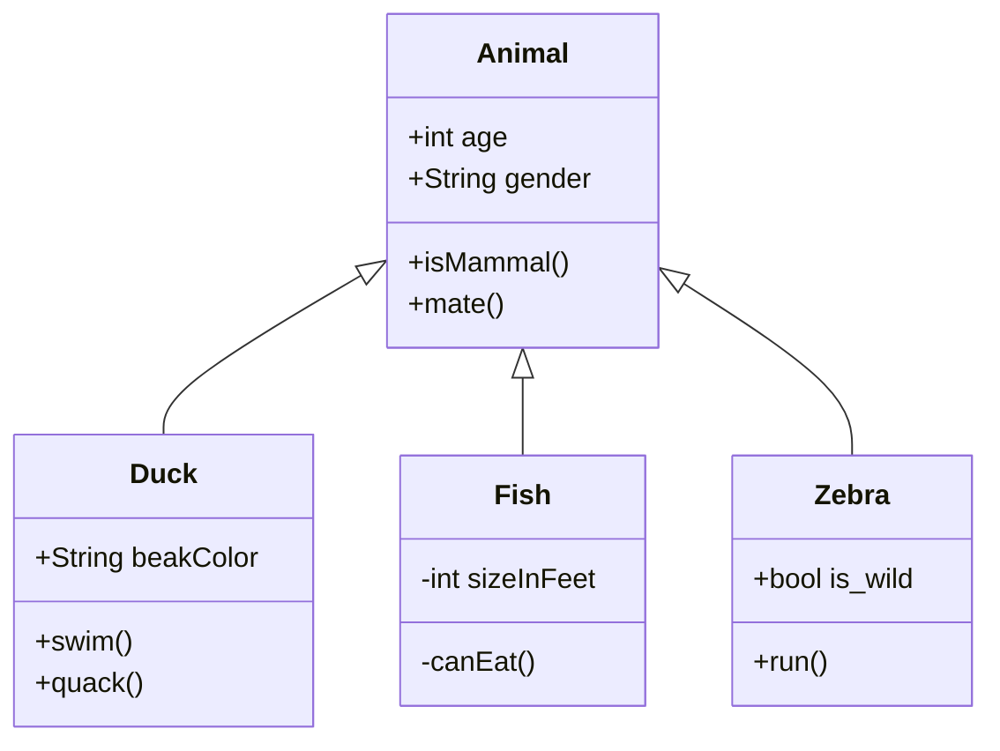

## 畫UML
### 教他UML
```

this code can draw UML,have you learned?
```

### 測試
```
Let's create a uml for anything you want
```

### 教他換顏色
```
%%{init: {'theme': 'base', 'themeVariables': { 'primaryColor': '#ff0000'}}}%% can change the color to red,have you learned?
```

### 測試
```
Let's change the color to light yellow
```


